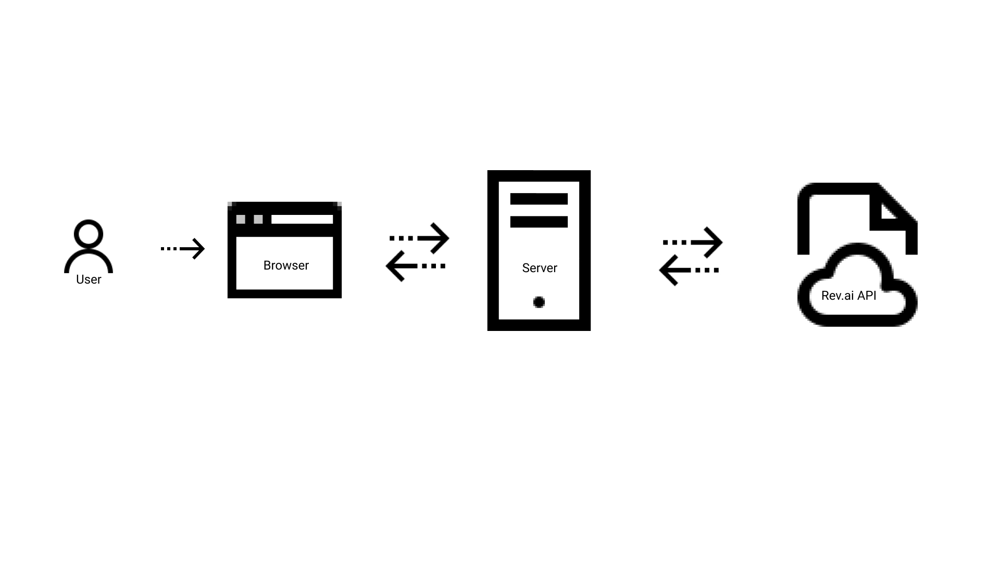
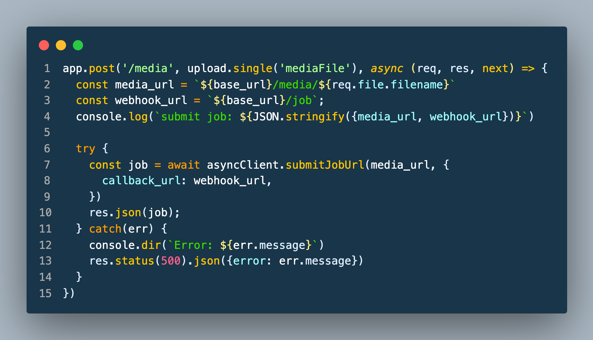
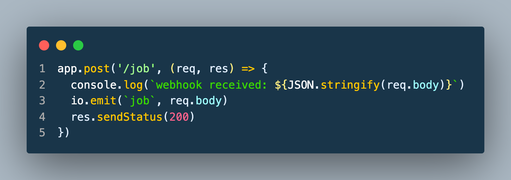
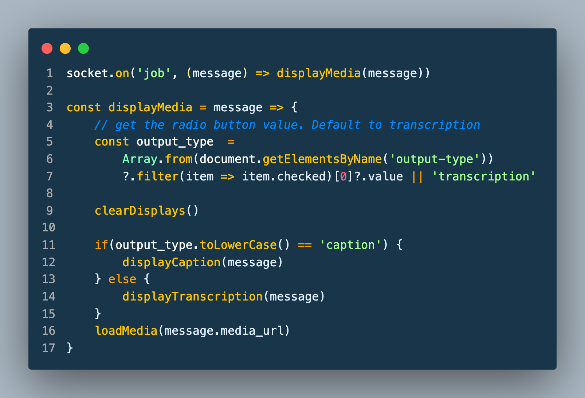
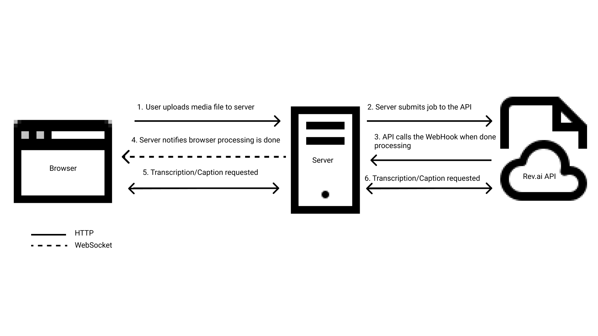
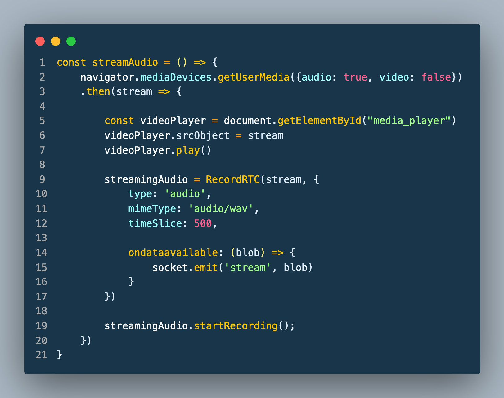
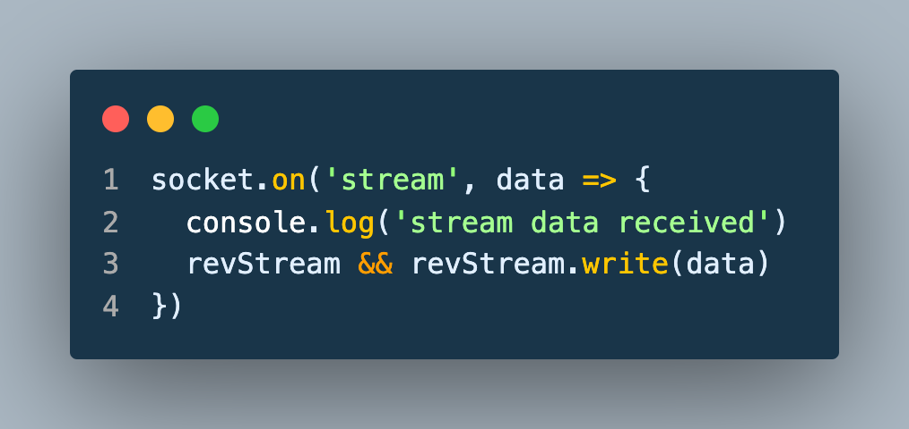
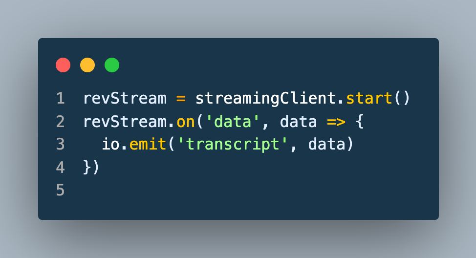

# speech-recognition-using-js

### Running the Web App

First run the following command to install of the necessary dependencies:

`npm install`

Next create a new file named .env or rename the sample.env and update the Environment variables as follows:

- access_token=<[Rev.ai](http://Rev.ai) access token>
- base_url= <url that Rev.ai can use to communicate with the server>
- media_path= <relative path of where to store uploaded media files>

Then run the following command to start the server:

`npm start`

In a browser navigate to either the value defined as the `base_url` or `http://localhost:3000`

---

This is a simple web application that works with the [Rev.ai](http://Rev.ai) speech-to-text API using javascript. The web application will allow a user to submit an audio/video file to be transcribed by the Rev.ai API. The web app will also allow a user to stream audio to and receive real-time speech-to-text transcriptions using their microphone. Going forward the Rev.ai API will be referred to as the API.

### Architecture

Communication with the APIs is dependent on an individual's access token which is also linked to payment information and can incur charges. For this reason, the access token should be kept secret to prevent unauthorized use. While it is technically possible to communicate with the APIs directly from the browser, browsers are not very good at keeping secrets. Using secrets and access tokens in the browser should be avoided. A server written in NodeJs using the Express framework is used to keep communication with the APIs secure while also facilitating communication between the browser and the APIs. The browser communicates with the server using a combination of HTTP requests and WebSocket messages. The Rev.) NodeSDK is used to communicate with the API from the server. The server also provides a webhook endpoint that can be called by the API when an asynchronous job submission is completed.

### Submit An Audio/Video File To Be Transcribed

The submit an audio/video file functionality demonstrates the API's asynchronous functionality. First, the user selects either an audio or video file to be processed by the API and whether they want to display the results as a caption or transcription. The file is then uploaded to the`/media` endpoint on the server as multi-part form data. To handle the file upload on the server, a file upload handler middleware library name Multer is used. Multer stores the file in a specified location on the server. A job is submitted to the API with a URL that points to the uploaded media file along with the URL to the webhook defined at the `/job` endpoint.

When the API has completed processing the job, the webhook endpoint is called. The server then sends the response from the API to the browser using the WebSocket connection. A status of 200 is returned to the API.

When the browser receives the `job` WebSocket message it sends a HTTP request to the server to retrieve either the transcription or caption from the API.

### Stream Microphone

The stream microphone feature demonstrates the API's streaming functionality. First the user clicks the `Start Recording` button to start the streaming session.  When the button is clicked the browser sends a request to the server to open a streaming connection with the API.  The browser then captures the users audio and sends it to the RecordRTC library. The RecordRTC library is used to encode the audio to wav format. The output of the encoding is then streamed to the server over the WebSocket connection.

The server then sends that data to the API. The API then sends back transcription information in real-time as it is being processed. When the server receives data from the API and sends it to the browser over WebSocket.

The browser then displays the transcription in real-time.

[Streaming API Example.mp4](docs/streaming-api-example.mp4)

The `Stop Recording` button is clicked when the user is finished streaming. When the button is clicked the browser sends a request to the server. The server then closes the streaming connection with the API.
